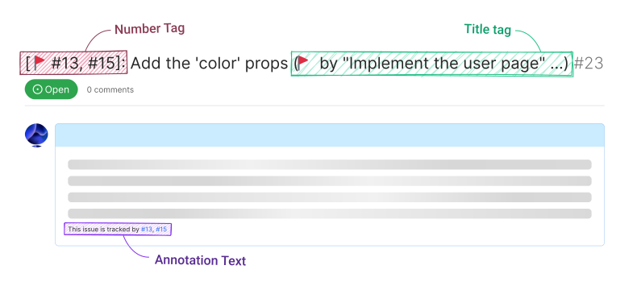

# loxygenK/better-tracking-issue

🚩 Task list の関係を見やすくする

## WIP
**まだ WIP なので、バグが潜んでいるかもしれません!!**

## 何をする Action?

**このアクションは、Task list への変更を検知して、追加された/削除された Issue のタイトルや本文（Tracked Issue）に、親 Issue （Tracking Issue）の番号や名前を書き込みます。**

- ️🗃️ Issue のリストで、その Issue が何に属しているのかが一目で分かるようになります。
- ️🗃️ 本文の一番下にも小さい Issue 番号のリストが追加されます。
- ️🗃️ 複数の Issue に Tracking されている場合でも表示できます。

#### 追加される要素

- **Number tag** (赤色のもの) 
  Tracking Issue（親 Issue）の番号のリストです。タイトルの頭に追加されます。

- **Title tag** (緑色のもの) 
  Tracking Issue のタイトルです。1 つのみ表示されます。 
  どの Issue を表示するかは調整できますが、デフォルトでは、**一番最近 Task list に Tracked Issue（子タスク）を追加した Issue** を表示しています。

- **Annotation text** (紫色のもの) 
  Tracking Issue の番号です（Number tag と一緒です）。タイトルの末尾に追加されます。

#### 実際の動作様子 (mp4)

https://user-images.githubusercontent.com/55672846/227721771-bf87b7c0-3d97-4eaf-ae08-42702570fda2.mp4

## Inputs

> **Note**
> 「Number tag」「Title tag」「Annotation text」については、次の「Issue に追加される要素」を参照してください。

#### `token` (🔶 必須)
Issue にアクセスするためのトークンです。**`GITHUB_TOKEN` を 使う際は、 `permission.issues: write` を設定してください!**

#### `number-tag-prefix`
Issue のタイトルの頭に追加される、Tracking Issue の番号が表示されるタグ（number tag）に使われる接頭語を指定します。
デフォルトでは `🚩` が設定されています。

#### `title-tag-prefix`
Issue のタイトルの後ろに追加される、Tracking Issue の名前が表示されるタグ（title tag）に使われる接頭語を指定します。
デフォルトでは `🚩` が設定されています。

#### `title-tag-strategy`
Title tag に表示される Issue を選択する方法を指定します。（Title tag には、現状 1 つの Issue のみ表示しかできません。）

複数の Issue にトラッキングされているときの、Title tag の挙動が不自然だと感じたら使用してみてください。

| デフォルト | 値               | Tracking Issue が追加された時  | Tracking Issue が削除された時  |
| :--------: | :--------------- | :----------------------------- | :----------------------------- |
|            | `fixed-lowest`   | Issue の番号が一番小さい Issue | Issue の番号が一番小さい Issue |
|            | `fixed-highest`  | Issue の番号が一番大きい Issue | Issue の番号が一番大きい Issue |
|     ☑️     | `latest-lowest`  | 追加された Issue               | Issue の番号が一番小さい Issue |
|            | `latest-highest` | 追加された Issue               | Issue の番号が一番大きい Issue |

> **Note**
> 今後、何らかの方法でどの Issue を表示するか直接番号で指定できるようにすることを考えています。

---

> **Note**
> 現状、設定を変更しても既存の Issue は壊れないようになっています。

> **Warning**
> この Action はまだ v0 なので、破壊的な変更が発生する可能性があります! この場合でも、既存の Issue は問題なくマイグレートできるように更新したいと考えています。

## 追加される要素

- **Number tag** (赤色のもの) 
  Tracking Issue（親 Issue）の番号のリストです。タイトルの頭に追加されます。

- **Title tag** (緑色のもの) 
  Tracking Issue のタイトルです。1 つのみ表示されます。 
  どの Issue を表示するかは調整できますが、デフォルトでは、**一番最近 Task list に Tracked Issue（子タスク）を追加した Issue** を表示しています。

- **Annotation text** (紫色のもの) 
  Tracking Issue の番号です（Number tag と一緒です）。タイトルの末尾に追加されます。

## ロードマップ
[英語の README を参照してください。](./README.md)
