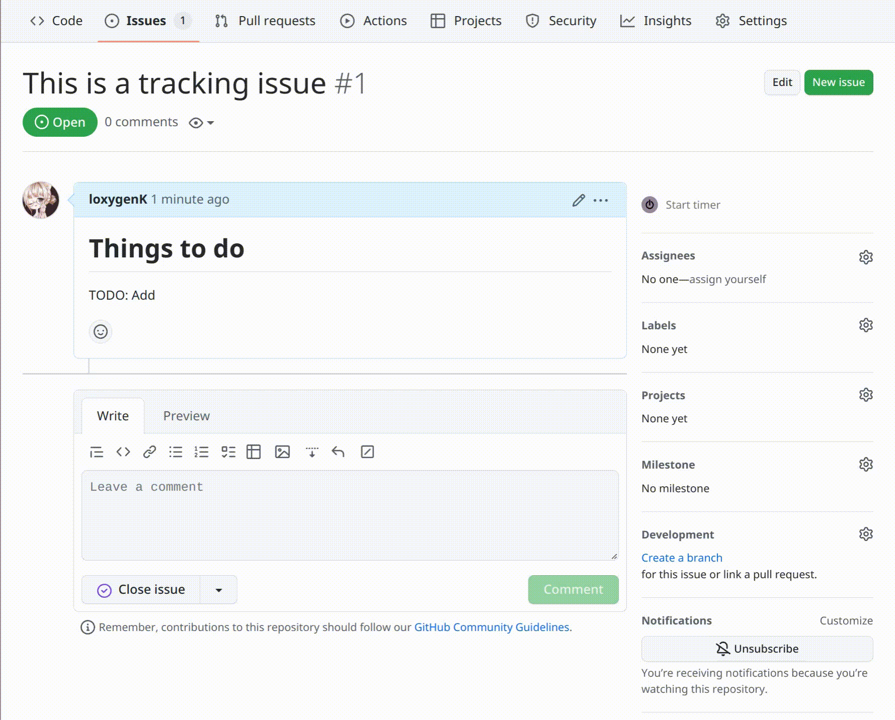

# loxygenK/better-tracking-issue

🚩 A github action for making tracking issues easier to manage and see

## WIP
**This action is still WIP, so there might be very nasty bugs.** Also, important safety features are missing, like...

- **The issue's tag will break if the action's configuration is changed.** 
  The old tag will not be removed automatically, and there will be two old and new tags if the tag format changes.

## What does this Action do?

**This action detects the change in the task list and adds the parent issue number to the title and description of issues in the list.**

- ️🗃️ You can see the tracking issue number from the issue list.
- ️🗃️ A tiny tracking issue list is created at the bottom of the body.

## Inputs

#### `token` (🔶 Requried)
A token to access issues. 
**`GITHUB_TOKEN` with `permission.issues: write` can be used.**

#### `tag`
The format of tracking issue number list prepended to the title. `<< id >>` is replaced by the issue number list.  
`[🚩 << id >>]` is set in default.

## Detailed description

- **Number tag** (The red one) 
  The tracker issue's number. The tag is added to the head of the issue's title. The emoji can be configured.

- **Title tag** (The green one) 
  The tracker issue's title. If the tracked issue is tracked by multiple issues, the most recent issue that started tracking is shown.

- **Annotation text** (The purple one) 
  The tracker issue's number. (The same information with the number tag) The text is appended to the body.

## Roadmaps

- [x] Deal with the configuration change
  - I decided to restrict the configuration instead. (At first, I thought I could log the commit hash of the setting
    (GitHub Action config file), but I thought that was too much effort… Maybe I will do this and be able to do
    a more flexible configuration in the far future)
- [ ] Add tracking issue's title to the tracked issues (`v0.1.0` here possibly)
- [ ] Make annotation text in the body configurable
