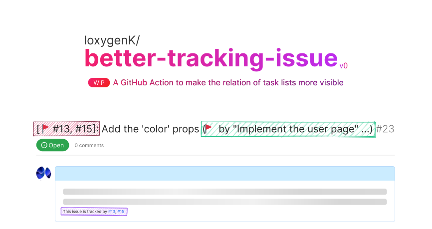

# loxygenK/better-tracking-issue

🚩 Make the relation of task list more visible

## WIP
**This action is still WIP, so there might be nasty bugs.**

## What does this Action do?

**This action detects the change in the [task list](https://docs.github.com/en/get-started/writing-on-github/working-with-advanced-formatting/about-task-lists) and adds the parent issue number to the title and description of issues in the list.**

- ️🗃️ You can see what the issue belongs to in the issue list at a glance.
- ️🗃️ A tiny tracking issue list is created at the bottom of the body.
- ️🗃️ It can display tags even the issue is tracked by multiple issues.

### Detailed description

- **Number tag** (The red one) 
  The tracker issue's number. The tag is added to the head of the issue's title. The emoji can be configured.

- **Title tag** (The green one) 
  The tracker issue's title. If the tracked issue is tracked by multiple issues, the most recent issue that started tracking is shown.

- **Annotation text** (The purple one) 
  The tracker issue's number. (The same information with the number tag) The text is appended to the body.

#### How it works (mp4)

https://user-images.githubusercontent.com/55672846/227721771-bf87b7c0-3d97-4eaf-ae08-42702570fda2.mp4

## Inputs

#### `token` (🔶 Requried)
A token to access issues. **Set `permission.issues: write` to use `GITHUB_TOKEN`!**

#### `number-tag-prefix`
Set the prefix used in the tag prepended to the issue title to display tracking issues' number.
`🚩` is set in default.

#### `title-tag-prefix`
Set the prefix used in the tag appended to the issue title to display tracking issues' title.
`🚩` is set in default.

#### `title-tag-strategy`
Specify how to select the issue to be displayed in the title tag. (Currently only one issue can be displayed to the title tag.)

Try using this if you felt that the behavior of title tags is unnatural when the issue is tracked by multiple issues.

| Default? | Value            | When a tracking issue is added        | Tracking Issue が削除された時     |
| :------: | :--------------- | :------------------------------------ | :-------------------------------- |
|          | `fixed-lowest`   | The issue with the lowest number (ID) | The issue with the lowest number  |
|          | `fixed-highest`  | The issue with the highest number     | The issue with the highest number |
|    ☑️     | `latest-lowest`  | The newly added issue                 | The issue with the lowest number  |
|          | `latest-highest` | The newly added issue                 | The issue with the highest number |

> **Note**
> I am planning to add a method to directly specify the issue to display using the issue's number.

---

> **Note**
> Currently, changing the settings does not break existing issues.

> **Warning**
> This action is still v0, so there might be breaking changes! Even in this case, I will do my best to be able to migrate the existing issue.

## Roadmaps

- [x] Deal with the configuration change
  - I decided to restrict the configuration instead. (At first, I thought I could log the commit hash of the setting
    (GitHub Action config file), but I thought that was too much effort… Maybe I will do this and be able to do
    a more flexible configuration in the far future)
- [x] Add tracking issue's title to the tracked issues (`v0.1.0` here possibly)
- [ ] Make annotation text in the body configurable
